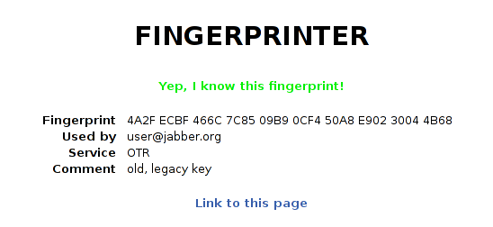

# Fingerprinter

With Fingerprinter you can run a webinterface which let's others check
fingerprints against a configured list of your own key fingerprints.

Simply compile, customize the config, add all your fingerprints to the
fingerprints.dat CSV file and start the service. It automatically parses the CSV
and creates the data entries.

Optionally you can define a `Keydir` in your config. This folder should contain
one or more PGP ASCII armored public key files from your own keys. They are parsed
and added to the list of fingerprints.

## Usage

To use the fingerprinter library, create a `main.go` program like this:

```golang
package main

import "fingerprinter"

func main() {
    fingerprinter.StartServer()
}
```

This could for example be placed in `$GOPATH/src/fingerprinter-bin/main.go`.

Then go into `$GOPATH/src/` and `git pull github.com/cooox/fingerprinter`. You can then build a binary with `go install fingerprinter-bin` which will be created at `$GOPATH/bin/fingerprinter-bin`.

To run the binary, link the `static` and `templates` folders into the `$GOPATH/bin/` folder and run the binary.

In the end, your folder structure should look like this (given you use the folder names from the example config.json):

```
.
|-- config.json
|-- fingerprinter-bin
|-- fingerprints.dat
|-- keys
|   |-- myfirstpgpkey.asc
|   `-- secretprivatekey.asc
|-- static
|   `-- style.css
`-- templates
    |-- base.html
    |-- index.html
    `-- result.html
```


## Screenshots

Pretty simple interface.




## Licence

This software is licenced under the GNU AGPL licence. See the LICENCE file for
more information.
